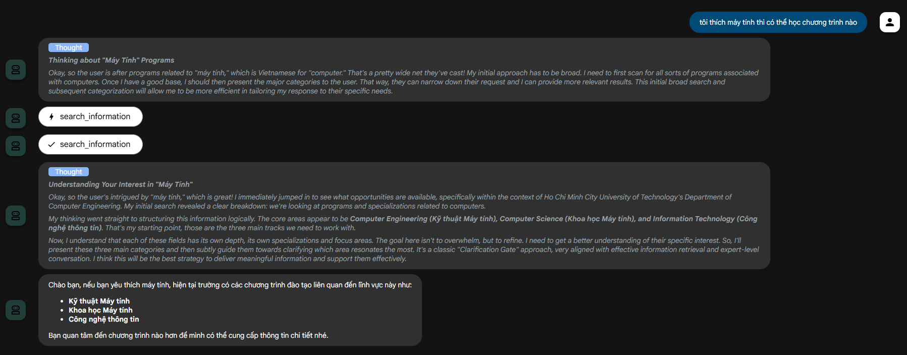

# URASys
Welcome to the official repository for **URASys: A Unified-Retrieval Agent-Based System for Clarification-Driven Educational Question Answering**.

---

## 🚀 Key Features

- **Verified Data Retrieval**: Provides answers drawn from curated FAQs, official policy documents, and program brochures.  
- **Bilingual Support**: Fully optimized for both English and Vietnamese questions and responses.  
- **Context-Aware Dialogue**: Maintains conversational context to handle follow-up inquiries naturally.  
- **Semantic Search Engine**: Utilizes dense embedding techniques for deep intent understanding.  
- **Agentic Reasoning**: Capable of multi-step logical reasoning (e.g., evaluating dual-degree options, transfer credit feasibility, scholarship eligibility).


---

## Quick setup 🚀

The following steps will help you to get the system up and running:

- Create an `.env` file from template (adjust settings accordingly):
    ```bash
    make setup-env
    ```
- Setup Milvus Cloud for vector database:
    1. Visit [https://zilliz.com/cloud](https://zilliz.com/cloud) and create an account
    2. Create a new cluster
    3. Copy the cluster endpoint and token
    4. Fill the following variables in your `.env` file:
        - `MILVUS_CLOUD_URI`: Your cluster endpoint
        - `MILVUS_CLOUD_TOKEN`: Your cluster token
- Create network for the whole system. This will create network `chatbot` and add to `.env` file with the corresponding value of the network subnet:
    ```bash
    make create-network
    ```
- Build and start the server:
    ```bash
    make up-build-chatbot
    ```
- Upload data to the system by accessing [http://localhost:8003/docs](http://localhost:8003/docs):
    - Upload FAQ data in CSV format
    - Upload document data in TXT format
    - Or you can upload data from web URLs directly
- Access the chatbot interface at [http://localhost:8010](http://localhost:8010):
    
---

We hope you enjoy exploring our project! If you have questions, feel free to open an issue or contribute to this repository. 😊 
